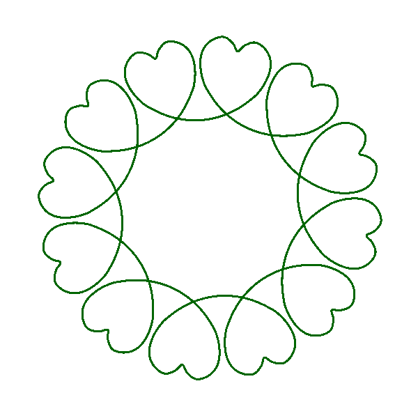

from https://github.com/marcusvolz/mathart

```{r libs, message=FALSE}
library(tidyverse); library(ggforce); library(ggart)
rad2deg <- function(rad) {(rad * 180) / (pi)}
deg2rad <- function(deg) {(deg * pi) / (180)}
```

```{r heart2}
#' Generate heart2 data
#'
#' Generates data for plotting a heart and stores it in a data frame with (x, y) coordinates and radius r
#' @param n The number of points to generate
#' @keywords heart
#' @export
#' @examples
#' heart2()

heart2 <- function(n = 1000000) {
  A <- function(t) {
    1 + 1/2*(cos(36*t))^10*(1 + 1/2*(cos(108*t))^12)
  }
  data.frame(t = seq(0, pi, pi/n)) %>%
    dplyr::mutate(
      x = 2/3*cos(2*t)*(1 - 1/7*(cos(12*t))^4*A(t)) + 1/4*sin(22*t + pi/2),
      y = 2/3*sin(2*t)*(1 - 1/7*(cos(12*t))^4*A(t)) + 1/4*cos(22*t + pi/2)
    ) %>%
    dplyr::select(-t)
}

```

```{r rotate}
rotate <- function(df, radians){
  newdf <- df %>% 
    mutate(xprime = df$x * cos(radians) + df$y * sin(radians),
           yprime = -1 * df$x * sin(radians) + df$y * cos(radians)) %>% 
    select(-x, -y) %>%
    rename(x = xprime,
           y = yprime)
}
```

```{r scale}
scaleCircle <- function(df, my_scale){
  newdf <- df %>%
    mutate(x = x * my_scale,
           y = y * my_scale)
}
```

```{r plot}
my_path <- "images/"
h <- heart2(n=100000)

palfunc<-colorRampPalette(c("red", "pink"))
palfunc<-colorRampPalette(c("#006600", "pink", "#0033FF", "red"))
pal<-palfunc(20)
rad <- seq(from=0.4, to=1, by=((1-0.4)/(20-1)))
siz <- seq(from=0.1, to=0.7, by=((0.7-0.10)/(20-1)))

txt <- data.frame(x=0, y=0, t = "", n=1:20, c="#006600", s=1) %>% 
  mutate(t = as.character(t),
         c = as.character(c))
txt$t[17:18] <- "Happy birthday"
txt$t[19] <- "Happy birthday, Liz"
txt$t[20] <- "Happy birthday, Liz!"
txt$c[17:20] <- c("#006600", "FFC0CB", "#0033FF", "FF0000")

for(i in 1:20){
  df <- data.frame()
  for(j in 1:i){
    df1 <- h %>%
      scaleCircle(rad[j]) %>% 
      rotate((i*pi)/18) %>%
      mutate(col = as.factor(j),
             siz = j)
    df <- rbind(df, df1)
    txt1 <- slice(txt, i)
  }
  p <- ggplot() +
    geom_path(aes(x, y, colour = col, size = siz), df, lineend = "round") +
    geom_text(data=txt1, aes(x=x, y=y, label=t), colour="red") +
    scale_color_manual(values=pal) +
    scale_size(range = c(0.1, 2)) +
    coord_fixed() +
    theme_blankcanvas(margin_cm = 1)
    print(sprintf("%shearts.%03d.png",  my_path, i, replace=TRUE)) #print the filename to track progress
      png(filename=sprintf("%shearts.%03d.png", my_path, i, replace=TRUE), #filename - prioritize points
          bg="transparent", type="cairo-png", height=600, width = 600)
      print(p)
      dev.off()
}
```

```{r animate, message=FALSE}
library(magick)
my_path <- "images/"

im_all<-image_read(paste0(my_path,dir(my_path)))
image_background(im_all, "white")
#im_all <- image_scale(im_all, "800")
hani<-image_animate(im_all, fps = 2)
image_write(hani,"hani.gif")
```



